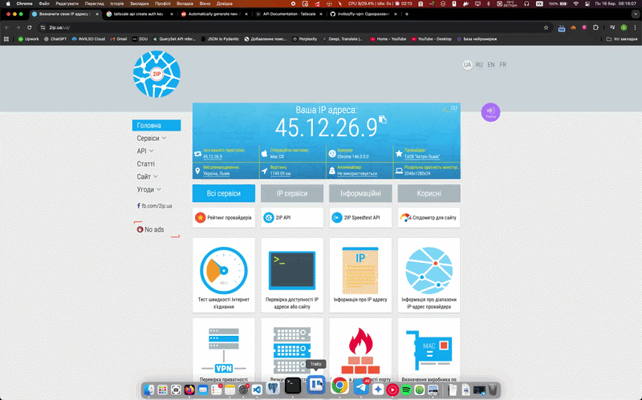

# 🛡️ Fly VPN — disposable global VPN in seconds

**One API key. One command. Private exit node in 18 regions.**

Fly VPN spins up an **ephemeral Tailscale exit node** on [Fly.io](https://fly.io), auto-configures your tailnet, routes your traffic, and **destroys everything** the moment you press Stop.

```bash
# 1. Clone & install
git clone https://github.com/invilso/fly-vpn.git && cd fly-vpn && bash install.sh

# 2. That's it. Paste your Tailscale API key when prompted.
#    ACL, auth keys, device cleanup — all automatic.
```

No always-on VM. No manual ACL editing. No auth key management. No billing anxiety. No shared IPs.

Under the hood: WireGuard-powered [Tailscale](https://tailscale.com) mesh + [Fly Machines](https://fly.io/docs/machines/) that cold-start in ~3 seconds and bill per-second. A typical session costs **a fraction of a cent**.

<p align="center">
  
</p>

---

## Use cases

- 🔒 **Test geo-restricted APIs** — hit endpoints as if you're in Frankfurt, Tokyo, or São Paulo
- 🛡️ **Secure browsing on public Wi-Fi** — route traffic through your own ephemeral node
- 🧪 **QA regional content** — verify localization, pricing, or CDN behavior per region
- 🏗️ **Dev/staging access** — reach region-locked services without a permanent VPN
- 🎯 **Ad & SEO audits** — see what users in different markets actually see
- 🚀 **Demo day** — show your product from a client's region in real time
- 🎮 **Gaming** — connect to region-locked servers or get a fresh IP in seconds

---

## Tech stack

| Layer | Technology |
|-------|------------|
| Language | Python 3.14 |
| TUI framework | [Textual](https://github.com/Textualize/textual) |
| Cloud runtime | [Fly.io](https://fly.io) (ephemeral machines) |
| VPN mesh | [Tailscale](https://tailscale.com) (WireGuard-based) |
| Package manager | [uv](https://docs.astral.sh/uv/) |
| Build backend | [Hatchling](https://hatch.pypa.io/) |
| Linter | [Ruff](https://docs.astral.sh/ruff/) |

---

## Requirements

- macOS or Linux (Windows is **not** supported)
- Python 3.14+
- [Fly.io](https://fly.io) account with a payment method on file
- [Fly.io CLI](https://fly.io/docs/flyctl/install/) (`fly`) — auto-installed by `install.sh`
- [Tailscale](https://tailscale.com) account + **API key** (handles everything automatically) — **or** a self-hosted [Headscale](https://github.com/juanfont/headscale) server with an auth key

---

## Why teams love it

- 🔑 **One API key** — ACL, auth keys, cleanup — all automatic
- 🌍 **18 gateway regions** — pick from dropdown, launch in seconds
- ⚡ **One-click launch** from a polished terminal UI
- 🔗 **Auto-connect** to the exit node when it comes online
- 🧹 **Safe teardown** on Stop / Quit / Signal
- 💸 **Cost-aware by design** — ephemeral infra only
- 🛟 **Watchdog mode** to remove orphaned Fly apps

---

## What happens when you press Launch

1. 🔑 **ACL check** — ensures your tailnet allows exit nodes (idempotent, via API)
2. 🔐 **Auth key** — generates a single-use, ephemeral key (valid 30 days, consumed instantly)
3. 🚀 **Fly machine** — starts a Tailscale container in your chosen region (~3 s cold start)
4. 🔗 **Auto-connect** — waits for the node to appear, then routes your traffic through it
5. 🗑️ **Press Stop** — disconnects, destroys machine + app, removes device from tailnet

> You provide one API key. Everything else is automated, per-session, and ephemeral.

---

## Quick start

```bash
git clone https://github.com/invilso/fly-vpn.git
cd fly-vpn
bash install.sh
```

The installer will ask for one thing: your **Tailscale API key** ([generate here](https://login.tailscale.com/admin/settings/keys)).

That single key gives Fly VPN everything it needs:
- ✅ **ACL auto-configuration** — exit-node tags, approvals, permissions
- ✅ **Per-session auth keys** — generated on every Launch, single-use, ephemeral
- ✅ **Instant device cleanup** — node deleted from tailnet on Stop

No auth key to create. No ACL to edit. No manual steps.

<details>
<summary>Full installer flow</summary>

1. Installs **uv** and **Fly CLI** (if missing)
2. Prompts for **TAILSCALE_API_KEY**
3. Asks if you use **Headscale** — prompts for `TS_LOGIN_SERVER` and manual auth key
4. Syncs dependencies
5. Checks Fly.io auth (opens `fly auth login` if needed)
6. Registers desktop entry (macOS Applications / GNOME menu)
7. Optionally sets up daily **watchdog** (orphan-app safety net)

</details>

---

## Why Fly.io?

| Criteria | Fly.io | AWS EC2 / Lightsail | DigitalOcean | Hetzner |
|----------|--------|---------------------|--------------|----------|
| Cold start | **~3 s** (Machines API) | 30–60 s | 30–55 s | 10–30 s |
| Per-second billing | ✅ | ❌ (per-hour) | ❌ (per-hour) | ❌ (per-hour) |
| Regions | 18 worldwide | 30+ | 15 | 5 |
| Destroy on stop | native (Machines) | manual / API | manual / API | manual / API |
| Free tier | 3 shared VMs, 160 GB out | 750 h/mo (t2.micro) | — | — |

**Bottom line:** Fly Machines are **pay-per-second**, start in seconds, and auto-destroy — ideal for ephemeral workloads. No idle costs when the VPN is off.

### Cost estimate

| Usage | Fly.io cost |
|-------|-------------|
| 1 h/day, 30 days (shared-cpu-1x, 256 MB) | **~$0.50–1.00/mo** |
| 4 h/day, 30 days | ~$2–4/mo |
| Always-on equivalent (730 h) | ~$3.50/mo |

> Compare: a \$5/mo DigitalOcean droplet runs 24/7 whether you need it or not. Fly VPN runs **only when you click Launch**.

---

## Why Tailscale?

| Criteria | Tailscale | OpenVPN | WireGuard (raw) | Cloudflare WARP |
|----------|-----------|---------|-----------------|------------------|
| Setup complexity | Zero-config mesh | Certs + config files | Key exchange + routing | Managed (no self-host) |
| NAT traversal | ✅ built-in (DERP) | Manual / STUN | Manual | N/A |
| Exit node support | ✅ native | Manual iptables | Manual iptables | ❌ |
| Auto-approve nodes | ✅ via ACL tags | ❌ | ❌ | N/A |
| Ephemeral nodes | ✅ (auto-expire keys) | ❌ | ❌ | N/A |
| Protocol | WireGuard underneath | TLS / UDP | WireGuard | WireGuard (modified) |

**Bottom line:** Tailscale gives us **WireGuard performance** with zero manual key management. Ephemeral auth keys + ACL auto-approval = nodes that appear, serve traffic, and vanish — no cleanup.

---

## Approaches compared

| Approach | Spin-up | Monthly cost (casual) | Cleanup | Multi-region |
|----------|---------|----------------------|---------|-------------|
| **Fly VPN (this project)** | ~5 s | **<$1** | automatic | ✅ 18 regions |
| Commercial VPN (Mullvad, PIA…) | instant | $5–10 | N/A | ✅ but shared IPs |
| Self-hosted WireGuard on VPS | 30–60 s | $5+ (always-on) | manual | one region per VPS |
| SSH SOCKS proxy | instant | $5+ (always-on VPS) | manual | one region per VPS |
| Outline VPN (Jigsaw) | 30–60 s | $5+ (always-on) | manual | one region per VPS |
| Cloud Functions + proxy | varies | pay-per-request | automatic | ✅ but complex |

**Fly VPN wins when you need:** your own IP (not shared), multi-region on demand, zero idle cost, and fully automated lifecycle.

---

## Fly VPN vs fly-tailscale-exit

[patte/fly-tailscale-exit](https://github.com/patte/fly-tailscale-exit) (1.6k ⭐) pioneered the idea of running Tailscale exit nodes on Fly.io. Fly VPN builds on the same concept but wraps it into a **zero-config product** instead of a DevOps guide.

| | fly-tailscale-exit | Fly VPN |
|---|---|---|
| **Setup** | 13 manual steps | `bash install.sh` + paste API key |
| **Keys to manage** | Auth key (create manually, keep alive) | None — generated per session |
| **ACL configuration** | Manual (copy-paste into admin) | ✅ Automatic on first launch |
| **Exit node approval** | Manual in Tailscale admin | ✅ Auto-approved via ACL |
| **Connect to exit node** | `tailscale up --use-exit-node=…` | ✅ Automatic |
| **Switch region** | Edit config + redeploy | Pick from dropdown → Launch |
| **Cleanup on stop** | ❌ Machine keeps running (💸) | ✅ App + machine + device destroyed |
| **Deployment model** | `fly deploy` (Dockerfile + fly.toml) | `fly m run` (no deploy, no repo) |
| **GitHub org required** | ✅ | ❌ |
| **UI** | None (CLI only) | Textual TUI with hotkeys |
| **Cost safety net** | None | Watchdog (cron/launchd) |
| **Headscale support** | ❌ | ✅ |
| **Desktop integration** | None | macOS .app / GNOME menu |

**tl;dr** — fly-tailscale-exit requires you to create keys, edit ACL, set up a GitHub org, deploy with Dockerfile, and manually connect. Fly VPN: paste one API key, press Launch.

> **Credit where due** — fly-tailscale-exit proved the idea works. Fly VPN just makes it zero-config.

---

## Tailscale setup (required once)

### Just an API key — everything else is automatic

Generate an API key at [Tailscale Admin → Keys → API keys](https://login.tailscale.com/admin/settings/keys) and paste it during install (or add to `.env`):

```env
TAILSCALE_API_KEY=tskey-api-…
```

On every Launch, Fly VPN will:

| Step | What | When |
|------|------|------|
| ACL setup | Adds `tag:ephemeral-vpn`, exit-node attrs, auto-approvers | First launch (idempotent, skips if already configured) |
| Auth key | Generates single-use, ephemeral, pre-authorized key | Every launch |
| Device cleanup | Deletes the node from your tailnet | Every stop |

You can also trigger ACL setup manually:

```bash
fly-vpn --setup-acl
```

<details>
<summary>Manual auth key (without API key)</summary>

If you prefer not to use an API key, create a **reusable, ephemeral, pre-authorized** auth key tagged with `tag:ephemeral-vpn` at the [Tailscale admin console](https://login.tailscale.com/admin/settings/keys):

```env
TAILSCALE_AUTHKEY=tskey-auth-…
```

You'll also need to configure ACL manually:

```jsonc
{
  "tagOwners": {
    "tag:ephemeral-vpn": ["autogroup:owner"]
  },
  "nodeAttrs": [
    {
      "target": ["tag:ephemeral-vpn"],
      "attr": ["can-be-exit-node"]
    }
  ],
  "autoApprovers": {
    "exitNode": ["tag:ephemeral-vpn"]
  }
}
```

> With a manual auth key, ephemeral nodes auto-remove in ~5–30 min instead of instantly.

</details>
```

---

## Self-hosted Tailscale (Headscale)

[Headscale](https://github.com/juanfont/headscale) is an open-source, self-hosted implementation of the Tailscale coordination server.
Fly VPN works with Headscale out of the box — just set the right env vars.

### 1. Set `TS_LOGIN_SERVER` in `.env`

The installer will ask if you use a self-hosted coordination server.
If you skipped it, add the variable manually:

```env
TS_LOGIN_SERVER=https://hs.example.com
```

The Fly exit node will register with your Headscale instance instead of `login.tailscale.com`.

### 2. Make sure your local client is on the same Headscale server

```bash
tailscale login --login-server=https://hs.example.com
```

Both the local machine and the Fly exit node must be on the **same** Headscale tailnet.

### 3. Create an auth key via Headscale

```bash
# Headscale CLI
headscale preauthkeys create --user your-user --reusable --ephemeral

# or via Headscale API
curl -X POST https://hs.example.com/api/v1/preauthkey \
  -H "Authorization: Bearer $HS_API_KEY" \
  -d '{"user":"your-user","reusable":true,"ephemeral":true}'
```

Put the key in `.env` as usual:

```env
TAILSCALE_AUTHKEY=your-headscale-preauth-key
```

### 4. ACL policy

Headscale ACLs live in the config file (typically `/etc/headscale/acl.yaml` or `acl.json`).
The same policy applies — allow the ephemeral tag and auto-approve exit nodes:

```yaml
# acl.yaml
tagOwners:
  tag:ephemeral-vpn:
    - your-user

autoApprovers:
  exitNode:
    - tag:ephemeral-vpn
```

### 5. Minimal `.env` for Headscale

```env
TAILSCALE_AUTHKEY=your-headscale-preauth-key
TS_LOGIN_SERVER=https://hs.example.com
```

> No `TAILSCALE_API_KEY` needed — Headscale removes ephemeral nodes immediately on disconnect.

### 6. Comparison

| Feature | Tailscale SaaS | Headscale |
|---------|---------------|-----------|
| Auth keys | Admin console | `headscale preauthkeys create` |
| ACL config | Web UI | Config file on server |
| Instant device cleanup (`TAILSCALE_API_KEY`) | ✅ Supported | ❌ Not compatible — not needed |
| Ephemeral node auto-remove | ~5–30 min | Immediate (on disconnect) |

---

## Run

```bash
# Preferred
fly-vpn

# Alternatives
uv run fly-vpn
python main.py
```

### Keyboard shortcuts

| Key | Action |
|-----|--------|
| `l` | Launch exit node |
| `s` | Stop and cleanup |
| `t` | Toggle dark/light theme |
| `q` | Quit |

---

## Safety model

- Exit-node usage is explicit (manual Launch)
- Exit route is removed during teardown
- Fly app/machines are destroyed on cleanup paths
- Tailscale device is removed instantly when API key is set (otherwise auto-removes in ~5–30 min)
- Auth keys are generated per-session, single-use, ephemeral (when using API key)
- Watchdog can be run from cron/CI to enforce cleanup

> Fly VPN does **not** replace your identity/privacy model. It automates infra lifecycle and routing ergonomics.

---

## Watchdog mode

Cleanup helper for CI/cron/manual recovery:

```bash
python main.py --watchdog
```

It checks for orphaned app resources and destroys them to prevent charges.

Tip: great as a daily cron safety net. The installer will offer to set this up automatically.

---

## Troubleshooting quick hits

- **"Fly.io not authenticated"** → run `fly auth login`
- **Region timeout / no capacity** → switch region in UI and retry
- **Node appears but no auto-connect** → run `tailscale set --exit-node=fly-vpn-exit`
- **Want hard cleanup now** → run watchdog: `python main.py --watchdog`

---

## Architecture (clean layered design)

```
flyexit/
├── app.py            # UI layer (Textual only)
├── session.py        # business orchestration (preflight/launch/connect/teardown)
├── fly_ops.py        # Fly.io adapter (CLI operations)
├── tailscale.py      # Tailscale adapter (local CLI)
├── tailscale_api.py  # Tailscale Admin API client (ACL, auth keys, devices)
├── acl_setup.py      # ACL business logic + CLI entry-point (--setup-acl)
├── diagnosis.py      # friendly failure hints
├── config.py         # persisted user config
├── constants.py      # defaults, regions, timeouts
├── styles.py         # UI styling
└── watchdog.py       # headless safety cleanup

main.py            # entry-point (app / watchdog / setup-acl)
install.sh         # installer/uninstaller
```

Design principle: **UI-only app layer + enum-based session orchestration + thin infrastructure adapters**.

---

## Uninstall

```bash
bash install.sh uninstall
```

---

## Roadmap

- [ ] **Drop `flyctl` dependency** — replace all CLI calls with the [Fly.io Machines API](https://fly.io/docs/machines/api/) directly, removing the only heavy external binary requirement
- [ ] **Windows support** — make installer, Tailscale integration, and routing work on Windows (PowerShell installer, Windows-native `tailscale.exe` path detection)
- [ ] **Linux app package** — `.deb` / `.rpm` / AUR package for one-line install on Linux
- [ ] **History screen in TUI** — a dedicated tab showing past sessions with region, duration, and cost (already implemented via `--stats`)
- [ ] **Multiple simultaneous nodes** — spin up nodes in several regions at once and switch between them without teardown
- [ ] **Auto-rotate on region failure** — if the chosen region has no capacity, automatically retry the next closest region instead of failing
- [ ] **Connection latency indicator** — show live ping to the exit node in the status bar so you can pick the fastest region
- [ ] **Long-session billing alert** — warn in the TUI after a configurable threshold (e.g. 2 h) to prevent accidental charges from a forgotten session
- [ ] **macOS menu bar widget** — a tiny status icon that shows VPN on/off state and lets you stop the session without opening the full TUI
- [ ] **Homebrew tap** — `brew install invilso/tap/fly-vpn` for a one-liner install without cloning the repo
- [ ] **Custom machine size picker** — let the user choose Fly Machine CPU/RAM tier (e.g. `shared-cpu-1x` vs `performance-2x`) from the TUI
- [ ] **Config profiles** — save named profiles (preferred region, machine size, etc.) and switch between them quickly

---

## License

MIT
